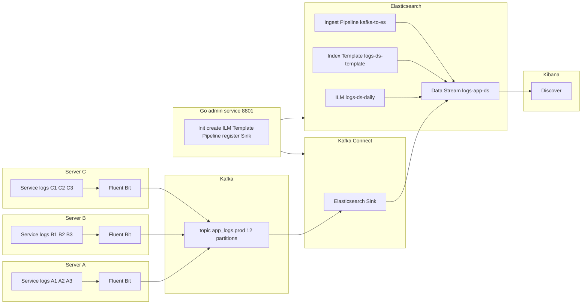

# log-pipeline

> 一套“Fluent Bit → Kafka → Kafka Connect（ES Sink） → Elasticsearch Data Stream → Kibana”的端到端日志采集与可视化示例，并内置 Go 管理服务用于一键初始化 ES 与注册 Sink Connector。

---

## 架构图



---

## 特性亮点
- **顺序保障**：Fluent Bit 使用 `key=host:app` 作为 Kafka Key，将同机同服务路由到同一分区，分区内严格有序。
- **去重标识**：Ingest Pipeline 基于 `(partition, offset)` 或 `(kafka_partition, kafka_offset)` 生成 `dedup_token`，方便下游幂等/去重。
- **Data Stream 原生化**：Connector 直接写入 Data Stream，结合 Template + ILM + Ingest Pipeline 统一治理。
- **一键初始化**：Go 管理服务提供 API/页面，创建 ES 资源并注册 Sink Connector。

---

## 目录结构（简要）
```
log-pipeline/
├─ docker-compose.yml
├─ fluent-bit/
│  ├─ fluent-bit.conf
│  ├─ parsers.conf
│  └─ compose_key.lua
├─ kafka-connector/
│  └─ go-pipeline-server/
│     ├─ config.yaml
│     ├─ elasticsearch/
│     │  ├─ logs-ds-daily.json
│     │  ├─ logs-ds-template.json
│     │  └─ pipeline.json
│     └─ connect/
│        └─ sink-es-app-logs.json
├─ web-dist/
│  └─ client-config.json
└─ mount_datas/
   ├─ kafka_data/
   ├─ es_data/
   └─ fb_db/
```

---

## 快速开始（Quick Start）
> 需求：
Docker & Docker Compose；
宿主机 Linux/macOS；
目前镜像支持 x86 架构；
确保 tcp 9092/19092/9200/9300/5601/8083/8801 等端口可用。

### 1) 准备日志目录与本地数据目录
```bash
chmod -R 777 mount_datas/
```

### 2) 部署核心服务组件
部署思路如上述架构图所示：A、B、C 业务服务器上分别部署Fluent Bit，用来配置日志路径做采集；另外准备一台服务器D部署核心服务： Kafka、Kafka Connect、Elasticsearch、Kibana。
```bash
D：
请手动检查以下文件中的硬编码 <HOST_IP> 位置 并替换为你的宿主机 IP/域名：
`docker-compose.yml`：`KAFKA_ADVERTISED_LISTENERS` 的 `EXTERNAL://<HOST_IP>:19092`
`kafka-connector/go-pipeline-server/config.yaml`：如需跨机访问，可将 `es.host`、`connect.host` 改为 `http://<HOST_IP>:9200` / `http://<HOST_IP>:8083`
`web-dist/client-config.json`：`{"api_base_url": "http://<HOST_IP>:8801"}`
```

### 3) 启动核心服务组件
```bash
docker compose up -d kafka 
间隔数秒后，kafka 启动没问题后,
docker compose up -d kafka-init
接着：
docker compose up -d elasticsearch kibana connect
```
等待 Kafka/ES/Kibana/Connect/管理服务全部就绪。


### 4) 初始化 ES 资源 & 注册 Connector
- 访问管理服务：`http://<HOST_IP>:8801`
- “初始化 / 更新（Elasticsearch & Kafka Connect）” 部分，依次点击，返回日志有OK、success等，代表启动请求生效
  - 点击 `PUT _ingest/pipeline`
  - 点击 `PUT _ilm/policy`
  - 点击 `PUT _index_template`
  - 点击 `PUT _data_stream`
  - 点击 `Register connectors sink`

> 可以在下面 `验证 / 查看（Elasticsearch）`、 `常用维护（Kafka Connect）` 板块里，依次点击按钮查看是否有返回一些配置信息、以及 Connector Status 是否有 RUNNING


### 5) 部署针对各个业务服务日志源节点的收集服务
> clone 项目到 A、B、C 上
> 
```bash
修改 log-pipeline/fluent-bit/fluent-bit.conf：
注意：一类服务对应一组[INPUT][FILTER]
1.改 `[INPUT] - Path` 、`[INPUT] - Tag` 
2.改 `[FILTER] - Match` （要等于上面的 `[INPUT] - Tag`）、`[FILTER] - env` 、`[FILTER] - host` 、`[FILTER] - app` 
3.改 `[OUTPUT] - Match` （要匹配上面的 `[INPUT] - Tag`） `[OUTPUT] - Brokers` 核心服务IP:19092 
```

### 6) 启动日志源节点收集服务
```bash
docker compose up -d fluent-bit
```

### 7) 在 Kibana 验证
- 打开 `http://<HOST_IP>:5601` → Discover 添加 index ：`logs-app-ds`
- 你应能看到：
  - `log` 原始日志内容
  - `@timestamp`（若原始包含 `ts` 则被归一到 @timestamp）
  - 从 `file_path` 提取的 `file_name`
  - `dedup_token`（基于 Kafka 位点生成）


---

## 组件与配置要点说明 & check

### Fluent Bit
- **Tail 输入**：采集 `/data/rtc-logs/agora/*.log*`
- **多行合并**：`multiline.parser` 针对堆栈等前导空白行进行粘连
- **字段增强**：`env`/`host`/`app` 等静态或通过环境变量注入
- **Kafka 输出**：`Message_Key_Field key`，其中 `key=host:app` 由 Lua 生成

### Kafka（KRaft 单机）
- **Topic**：`app_logs.prod`（12 分区）
- **监听**：`INTERNAL`（容器内）+ `EXTERNAL`（宿主机对外 19092）

### Kafka Connect（ES Sink）
- **Data Stream 模式**：`external.resource.usage=DATASTREAM`
- **映射**：`topic.to.external.resource.mapping=app_logs.prod:logs-app-ds`
- **Ingest Pipeline**：`use.ingest.pipeline=true`、`ingest.pipeline.name=kafka-to-es`
- **错误处理**：`errors.tolerance=all`、可选 DLQ 主题（如 `dlq.app_logs.prod`）

### Elasticsearch
- **Index Template**：`logs-ds-template`（绑定 Data Stream 前缀，默认 Pipeline、映射、ILM）
- **Ingest Pipeline**：`kafka-to-es`（归一 `@timestamp`、提取 `file_name`、生成 `dedup_token`）
- **ILM**：`logs-ds-daily`（按需设置热/温/冷/删）

### Kibana
- **Discover**：以 `logs-app-ds` 为默认数据视图，检索与可视化日志

### Go 管理服务（:8801）
- **配置**：`config.yaml` 指定 ES、Connect、资源文件路径、前端静态目录
- **职责**：一键初始化 ES 资源与注册 Connector；提供前端配置文件 `client-config.json`

---

## 许可证


