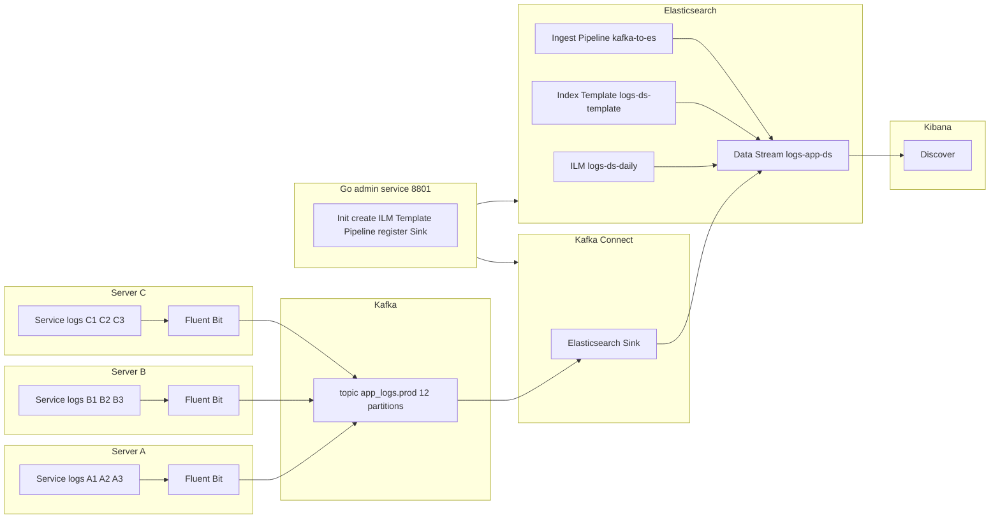

## 架构图

```mermaid
flowchart LR

subgraph A [Server A]
  ALOGS[Service logs A1 A2 A3]
  AF[Fluent Bit]
  ALOGS --> AF
end

subgraph B [Server B]
  BLOGS[Service logs B1 B2 B3]
  BF[Fluent Bit]
  BLOGS --> BF
end

subgraph C [Server C]
  CLOGS[Service logs C1 C2 C3]
  CF[Fluent Bit]
  CLOGS --> CF
end

subgraph KAFKA [Kafka]
  TOPIC[topic app_logs.prod 12 partitions]
end

AF --> TOPIC
BF --> TOPIC
CF --> TOPIC

subgraph KC [Kafka Connect]
  SINK[Elasticsearch Sink]
end

TOPIC --> SINK

subgraph ES [Elasticsearch]
  DS[Data Stream logs-app-ds]
  PIPE[Ingest Pipeline kafka-to-es]
  TPL[Index Template logs-ds-template]
  ILM[ILM logs-ds-daily]
  PIPE --> DS
  TPL --> DS
  ILM --> DS
end

SINK --> DS

subgraph KB [Kibana]
  DISC[Discover]
end

DS --> DISC

subgraph ADMIN [Go admin service 8801]
  API[Init create ILM Template Pipeline register Sink]
end

ADMIN --> KC
ADMIN --> ES
```